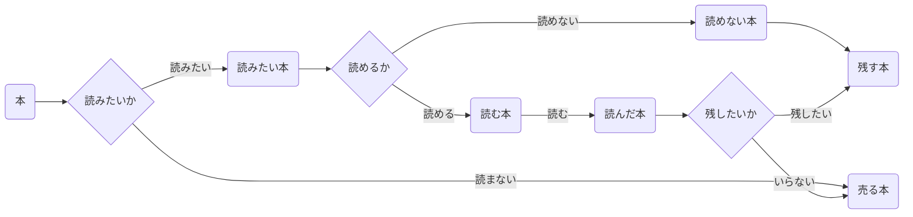

```mermaid
flowchart LR

B1(本) --> Q1{読みたいか}
Q1 -->|読みたい| B2(読みたい本)
Q1 -->|読まない| B3(売る本)

B2 --> Q2{読めるか}
Q2 -->|読める| B4(読む本)
Q2 -->|読めない| B5(読めない本)

B4 -->|読む| B6(読んだ本)
B5 --> B7(残す本)

B6 --> Q3{残したいか}
Q3 -->|残したい| B7
Q3 -->|いらない| B3

```

