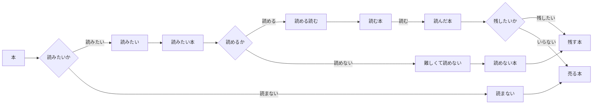

```mermaid
flowchart LR

B1[本] --> Q1{読みたいか}
Q1 -->|読みたい| A11[読みたい]
A11 --> B2[読みたい本]
Q1 -->|読まない| A12[読まない]
A12 --> B3[売る本]

B2 --> Q2{読めるか}
Q2 -->|読める| A21[読める読む]
A21 --> B4[読む本]
Q2 -->|読めない| A22[難しくて読めない]
A22 --> B5[読めない本]

B4 -->|読む| B6[読んだ本]
B5 --> B7[残す本]

B6 --> Q3{残したいか}
Q3 -->|残したい| B7
Q3 -->|いらない| B3

```

