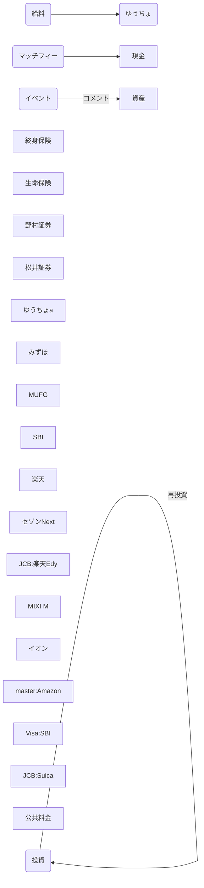

## お金の流れ

```mermaid
flowchart LR

S1(給料) --> B1(ゆうちょ)
S2(投資) -->|再投資| S2
S3(マッチフィー) --> A1[現金]

A1[現金]
A2a[終身保険]
A2b[生命保険]
A3a[野村証券]
A3b[松井証券]

B1a[ゆうちょa]
B2[みずほ]
B3[MUFG]
B4[SBI]
B5[楽天]

C1[セゾンNext]
C2[JCB:楽天Edy]
C3[MIXI M]
C4[イオン]
C5[master:Amazon]
C6[Visa:SBI]
C7[JCB:Suica]

O[公共料金]

b(イベント) --> |コメント| s[資産]

```
